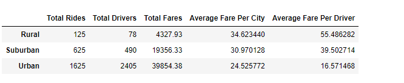

# Pyber_Analysis

## Overview

##### I used Python graphing library Matplotlib to create visualizations of rideshare data for PyBer to help improve access to ride-sharing services and determine affordability for underserved neighborhoods. Below is a summary DataFrame of the ride-sharing data by city type and a multiple-line graph that shows the total weekly fares for each city type. 

## Analysis
##### From the dataframe summary below, we can draw the following conclusions:
- ##### There are substantial more drivers and rides in urban communities.  38% more  than suburban communnities and 79% percent more than in rural communities.  
- ##### Urban communities generated 104% more revenue than rural communities and 49% percent more than suburban communities.  
- ##### The average fare per driver in rural communities is almost three times as much as urban communities. 
- ##### The average fare per driver in suburban communities is almost twice as much as urban communities. 

##### From the multiple line chart below, we can draw the following conclusions:
- ##### Urban cities generated the most income from January-April 2019. 
- ##### Revenue spiked in all three city types in February 2019 and was at it's lowest in January 2019.' 
- 
- 

## Conclusion and recommendations
##### The fares in rural and suburban cities are substantially higher than fares in urban cities.  This could possibly be because the number of drivers are also lower in rural and suburban cities.  The high prices could be affecting the number of rides subsequesntly effecting the revenue.  Increasing the number of drivers and/or rides and decreasing the fares may increase revenue in those city types.  I would also suggest collecting data around the length of the rides and demographic information in rural and suburban cities. The data can help us determine if there is a need for ride share in those communities. For example: what percentage of the population has cars, how far are customers traveling and where they are traveling to. 
