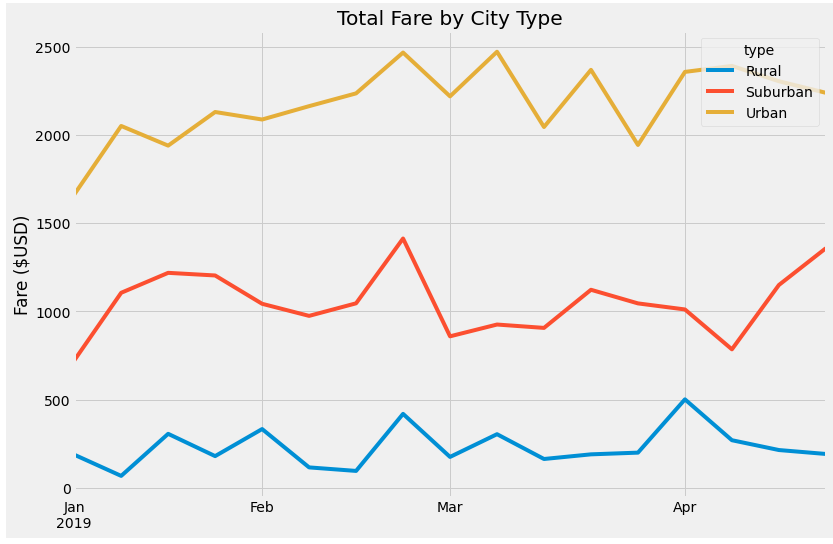

# Pyber_Analysis

## Overview

##### I used Python graphing library Matplotlib to create visualizations of rideshare data for PyBer to help improve access to ride-sharing services and determine affordability for underserved neighborhoods. Below is a summary DataFrame of the ride-sharing data by city type and a multiple-line graph that shows the total weekly fares for each city type. 

